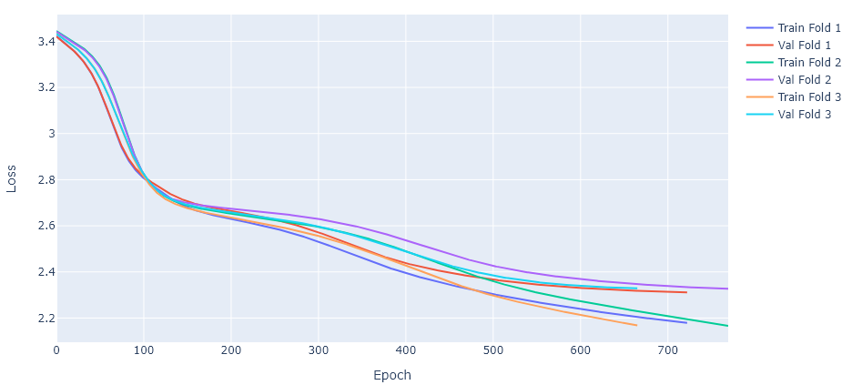
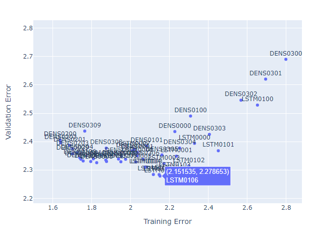

# Summary

`deep-namegen` uses dense and LSTM neural networks, implemented using Tensorflow/Keras, which procedurally generate novel proper names for things such as locations and people. The models are trained on a word list (such as the list of US cities names). The following is sample output from the US cities dataset:

```
Fort Grove
Lynford
Dagmore
Podingsburg
Pickerton
Welless Afb
Littlader
Browningtown
New Bluffs
Palosa
```

# Setup

Create a new virtual environment and install packages in `requirements.txt`. Tensorflow works best with CUDA support. For `tensorflow 2.2`, this will use the slightly older 10.1 CUDA Development Kit from NVIDIA. If you're using a newer version of TensorFlow, installing the appropriate version. Add the full path  (e.g. `C:\Program Files\NVIDIA GPU Computing Toolkit\CUDA\v10.1\bin`) to your environmental `PATH` variable. In addition to the CUDA Development Kit, the CuDNN package also must be installed and needs to match the same version as the developer toolkit.

If working on a laptop, you may also need to open the Display control panel (`Control Panel > Hardware and Sound > NVIDIA Control Panel > Manage 3D Settings` ) and under `Program Settings` , force Python to use the GPU.

# Usage

The basic steps are to prepare and process the raw data, conduct a parameter search using K-Fold validation (i.e. find the best network architecture), refit the optimal model, then generation of novel sequences. Most the workflow can be done from the command line without modifying the Python scripts.

Data sets available for experimentation (see `input` subdirectory):

- `us_cities.txt`: 29,880 US cities taken from the SQL database provided at https://github.com/kelvins/US-Cities-Database.git.
- `bible_characters.txt`: List of bible characters, adapted from https://www.wikidata.org/wiki/Wikidata:Lists/List_of_biblical_characters.
- `testing.txt`: Simple test patterns used in unit testing.
- `counties.txt`: Counties in Pennsylvania USA, a small example used for testing.

The following is an example workflow for generating a model for the biblical characters dataset. First pre-process and prep the data:

```
>python preprocessing.py bible_characters 6
```

Next we will try and find the best network architecture. The library of models is built in `models.py` , modify as appropriate. 

- **Note:** Keras is fairly good about not duplicated models. It is therefore necessary to create a new model for *every single fold* during the parameter search (i.e. each model needs a new call to `tf.keras.models.Sequential()`. The `param_search` script takes two command line arguments, the number of epochs to run for, and the batch size. The parameter search employs early stopping, so it's okay to be conservative and set the numbers of epochs high:
- **Note:** The prefix of the model name does matter. The LSTM networks take a different input than the dense networks, so ensure the prefix is set to either `LSTM ` or `DENS` as appropriate.

```
>python param_search.py
usage: param_search.py [-h] label epochs batch_size
param_search.py: error: the following arguments are required: label, epochs, batch_size
>python param_search.py bible_characters 2000 5000
```

This will generate several files in the `./output/` and the `./images/` directory using the supplied token/label. In between runs of the workflow, the files in these directories can be deleted. The `images` directory will contain a summary of the training:

This shows the model loss as a function of training epoch for both the training and validation (out-of-bag) set for all folds. The training should terminate as the validation set begins to level off. This will be at a different epoch for each fold due to changes in training data and the randomization in  the network weight initialization.

Once training is complete for all the models, the results can be viewed interactively to manually select a model:

```
> python view_param_search.py bible_characters
```



This is an interactive Plotly chart, so Python must have the ability to launch a web browser. If offline mode is preferred, some edits to `view_param_search.py` are required. Once a model is selected, a final pass is made, including all the data:

```
>python final_fit.py bible_characters LSTM0104 2000
```

By default, 20% of the data is withheld for validation in early stopping. Finally, the new model can be used to generate novel names:

```
>python generate.py bible_characters LSTM0104
Mabel
Jahez
Jobiel
Balam
Elash
Miulith
Phirar
Sassam
Phezelom
Camikah
Uel
Joboh
Arash
```


# Methods

Coming soon...

# TODO

- Continue linting code and documentation, check/expand unit testing in `testing.py`
- Add an error rate prediction using the test set to the final model fitting. Translate the cross-entropy into something understandable to humans.

