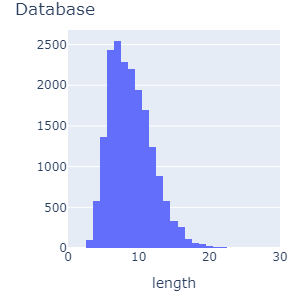
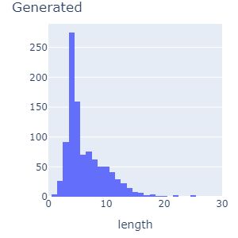

# Summary

This is a project to create a simple neural network using Tensorflow/Keras which procedurally generates city or people names.

Currently the only available training set is that of 29,880 US cities, `in/us_cities.txt`, taken from the SQL database provided at https://github.com/kelvins/US-Cities-Database.git.

## Starting the Sequence

The `y` vector for the first two letters of a name will be taken from the probability distribution.

## Issues with Generated Name Size

Using a naïve rolling window approach, the name generator tends toward shorter names than those found in the original database. I attribute this to few samples having both the initial padding and termination character being present (e.g. `^^BURG$` looks pretty good because there are no samples to the contrary.

After adding an additional `x` variable for position in sequence:

