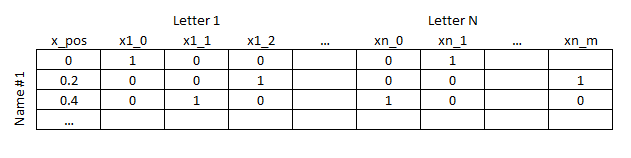
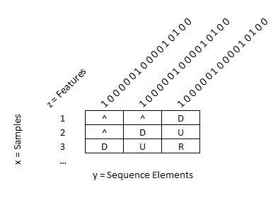

# Summary

`deep-namegen` uses dense and LSTM neural networks, implemented using Tensorflow/Keras, which procedurally generate novel proper names for things such as locations and people. The models are trained on a word list (such as a comprehensive list of US cities). The following is sample output from the US cities dataset:

```
Fort Grove
Lynford
Dagmore
Podingsburg
Pickerton
Welless Afb
Littlader
Browningtown
New Bluffs
Palosa
```

# Setup

Create a new virtual environment and install packages in `requirements.txt`. Tensorflow works best with CUDA support. For `tensorflow 2.2`, this will use the slightly older 10.1 CUDA Development Kit from NVIDIA. If you're using a newer version of TensorFlow, installing the appropriate version. Add the full path  (e.g. `C:\Program Files\NVIDIA GPU Computing Toolkit\CUDA\v10.1\bin`) to your environmental `PATH` variable. In addition to the CUDA Development Kit, the CuDNN package also must be installed and needs to match the same version as the developer toolkit.

If working on a laptop, you may also need to open the Display control panel (`Control Panel > Hardware and Sound > NVIDIA Control Panel > Manage 3D Settings` ) and under `Program Settings` , force Python to use the GPU. Power saving features might cause training to crash otherwise.

# Usage

The basic steps are to prepare and process the raw data, conduct a parameter search using K-Fold validation (i.e. find the best network architecture), refit the optimal model, then generate novel sequences. Most the workflow can be done from the command line without modification to the Python scripts.

Data sets available for experimentation (see `input` subdirectory):

- `us_cities.txt`: 29,880 US cities taken from the SQL database provided at https://github.com/kelvins/US-Cities-Database.git
- `bible_characters.txt`: List of bible characters, adapted from https://www.wikidata.org/wiki/Wikidata:Lists/List_of_biblical_characters
- `testing.txt`: Simple test patterns used in unit testing
- `counties.txt`: Counties in Pennsylvania USA, a small example also used for testing

The following is an example workflow for generating a model for the biblical characters dataset. First pre-process and prep the data, specifying the dataset and sequence window size:

```
>python preprocessing.py bible_characters 6
```

Next we will try and find the best network architecture. The library of models is built by `models.py` , modify as appropriate. 

- **Note:** Keras is fairly good about not duplicating models. It is therefore necessary to create a new model for *every single fold* during the parameter search (i.e. each model run needs a call to `tf.keras.models.Sequential()`).
- **Note:** The prefix of the model name *does matter*. The LSTM networks take a different input than the dense networks, so ensure the prefix is set to either `LSTM ` or `DENS` as appropriate (see details in `Methods`).

The `param_search` script takes two command line arguments, the number of epochs to run for, and the batch size. The parameter search employs early stopping, so it's okay to be conservative and set the numbers of epochs high. The batch size should be set as high as possible and will in general be limited by memory available on the GPU.

```
>python param_search.py
usage: param_search.py [-h] label epochs batch_size
param_search.py: error: the following arguments are required: label, epochs, batch_size
>python param_search.py bible_characters 2000 5000
```

This will generate several files in the `./output` and the `./images` directories using the supplied token/label. In between runs of the workflow, the files in these directories can be deleted. The `./images` directory will contain a summary of the training:

This shows the model loss as a function of training epoch for both the training and validation (out-of-bag) set for all folds. The training should terminate as the validation set begins to level off. This will be at a different epoch for each fold due to changes in training data and the randomization in the network weight initialization.

Once training is complete for all the models, the results can be viewed interactively to manually select a model:

```
> python view_param_search.py bible_characters
```


This is an interactive Plotly chart, so the Python interpreter must have the ability to launch a web browser. If offline mode is preferred, some edits to `view_param_search.py` are required. Once a model is selected, a final pass is made, including all the data:

```
>python final_fit.py bible_characters LSTM0104 2000
```

By default, 20% of the data is withheld for validation in early stopping. Finally, the new model can be used to generate novel names:

```
>python generate.py bible_characters LSTM0104
Mabel
Jahez
Jobiel
Balam
Elash
Miulith
Phirar
Sassam
Phezelom
Camikah
Uel
Joboh
Arash
```

# Methods

All input data is made upper case and limited to the tokens `ABCDEFGHIJKLMNOPQRSTUVWXYZ'_-`. Caret `^` and dollar sign `$` are not allowed in raw input strings, and are used for prefix padding and the end of word/sequence marker respectively. The data is split into training and test sets before any additional encoding to prevent "data leakage" between the two sets. In a future revision, it might be desirable to create the folds for K-fold cross validation at this point for similar "data leakage" reasons.

For each input name a sequence of inputs is creating by moving a rolling window over the name. A left padding string of size `window` (e.g. `^^^^^` for a window size of 5) is prepended to the name to create the start of sequence. For example, the city "Durham" would have the following pairs of input/outputs encoded with a rolling window of size 3:

| Input | Output |
| :---: | :----: |
| `^^^` | `D`   |
| `^^D` | `U`   |
| `^DU` | `R`   |
| `DUR` | `H`   |
| `URH` | `A`   |
| `RHA` | `M`   |
| `HAM` | `$`   |

The next step is a [one-hot encoding](https://scikit-learn.org/stable/modules/generated/sklearn.preprocessing.OneHotEncoder.html), but first some compensation must be made for the first and second letter in the sequence. The reason is that for an input that represents the start of word (`^^^`) and a one-hot encoding, the network will incur large structural errors when the target is not the most frequent first letter in the data set. To get around this problem, the algorithms replaces the binary [0,1] one-hot encoding with a floating probability of occurrence (which sums to one). Similarly for the second letter, the encoding is replaced with the probability of the second letter, but this time conditioned on the first (see the `StatisticalProb` class in `preprocessing.py` for more information).

The shape of the input data varies according to network type: feed-forward dense layer networks (`DENS`) take a flattened input vector. To improve network performance, the location of the window within the string is prepended to the one-hot encoding. The intention is to positional effects, e.g. the end of word token (`$`) is unlikely to occur at the beginning of the sequence. The input follows the pattern:



The recurrent neural network input layers (`LSTM`) need the data structured into a 3D tensor. The shape of this tensor is `i = samples, j = token, k = features/encoding`. Positional contextual data should not be needed, as this is what the "memory gates" in the LSTM architecture are trying to accomplish. The input data therefore takes the following shape (only the first rows of features are shown here for clarity):



The best model/parameter settings are found using [K-Fold cross-validation](https://en.wikipedia.org/wiki/Cross-validation_(statistics)). The models used in the search can be found in the `model_dict` dictionary created by `models.py`. The variables considered in this project are network size, number of dense layers, use of drop-out layers, and the use of LSTM as the first input layer. The best model is then re-fit and serialized to binary format.

Prediction of novel entries is done by presenting the final model with the starting sequence (`^^^...`) and obtaining the probabilities of the first character in the sequence (the final `softmax` layer predicts class probabilities). A random number between [0,1) is chosen and assigned a letter based on the predicted probabilities. This letter is then stored, and the whole process "rolls-forward" to the second letter. This process is repeated until the end of word delimiter "$" is predicted. The name is then checked against the training database to ensure there is no match, and if not, the process repeats.

The current code then outputs the histogram of predicted word lengths at the end. If the algorithm is working, this should have the same distribution and shape as the source data. Otherwise, some exploratory data analysis is needed to find out why early termination might be occurring.